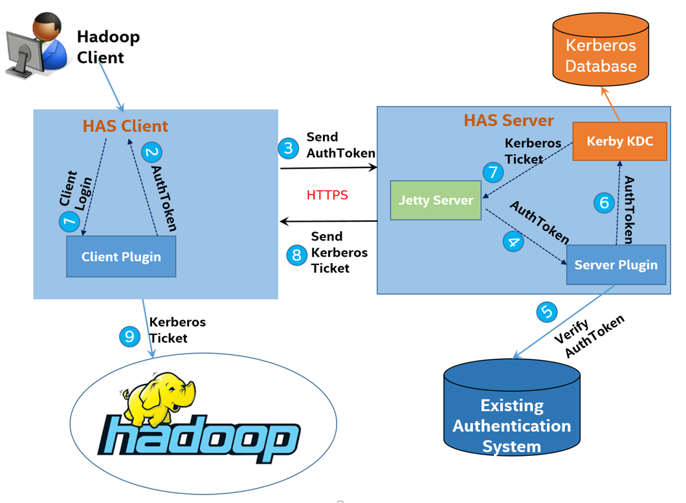

<!--
  Licensed to the Apache Software Foundation (ASF) under one
  or more contributor license agreements.  See the NOTICE file
  distributed with this work for additional information
  regarding copyright ownership.  The ASF licenses this file
  to you under the Apache License, Version 2.0 (the
  "License"); you may not use this file except in compliance
  with the License.  You may obtain a copy of the License at

  http://www.apache.org/licenses/LICENSE-2.0

  Unless required by applicable law or agreed to in writing,
  software distributed under the License is distributed on an
  "AS IS" BASIS, WITHOUT WARRANTIES OR CONDITIONS OF ANY
  KIND, either express or implied.  See the License for the
  specific language governing permissions and limitations
  under the License.
-->

# Hadoop Authentication Service (HAS)
A dedicated Hadoop Authentication Server to support various authentication mechanisms other than just Kerberos.

# High level considerations
* Hadoop services are still strongly authenticated by Kerberos, as Kerberos is the only means so far to enable Hadoop security.
* Hadoop users can remain to use their familiar login methods.
* Security admins won't have to migrate and sync up their user accounts to Kerberos back and forth.
* New authentication mechanism can be customized and plugined.

# Architecture


# Design
Assuming existing users are stored in a SQL database (like MySQL), the detailed design and workflow may go like the following:


# New mechanism plugin API

## HAS client plugin HasClientPlugin:

```Java
// Get the login module type ID, used to distinguish this module from others. 
// Should correspond to the server side module.
String getLoginType()

// Perform all the client side login logics, the results wrapped in an AuthToken, 
// will be validated by HAS server.
AuthToken login(Conf loginConf) throws HasLoginException
```

## HAS server plugin HasServerPlugin:

```Java
// Get the login module type ID, used to distinguish this module from others. 
// Should correspond to the client side module.
String getLoginType()

// Perform all the server side authentication logics, the results wrapped in an AuthToken, 
// will be used to exchange a Kerberos ticket.
AuthToken authenticate(AuthToken userToken) throws HasAuthenException
```
## High Availability
Please look at [High Availability](docs/has-ha.md) for details.

## Cross Realm
Please look at [How to setup cross-realm](docs/cross-realm.md) for details.

## Performance test report
Please look at [Performance test report](docs/performance-report.md) for details.

## List of supported Hadoop ecosystem components

|   Big Data Components   |           Supported         |   Rebuild Required   |
|:-----------------------:|:---------------------------:|:--------------------:|
| Hadoop                  | Yes                         | Yes                  |
| Zookeeper               | Yes                         | Yes                  |
| HBase                   | Yes                         | Yes                  |
| Hive                    | Yes                         | No                   |
| Phoenix                 | Yes                         | No                   |
| Thrift                  | Yes                         | No                   |
| Spark                   | Yes                         | No                   |
| Oozie                   | Yes                         | No                   |
| Presto                  | Yes (0.148 and later)       | No                   |
| Pig                     | Yes                         | No                   |
| Sqoop                   | Yes                         | No                   |

## Getting Started
Please look at [Getting Started](docs/has-start.md) for details.
